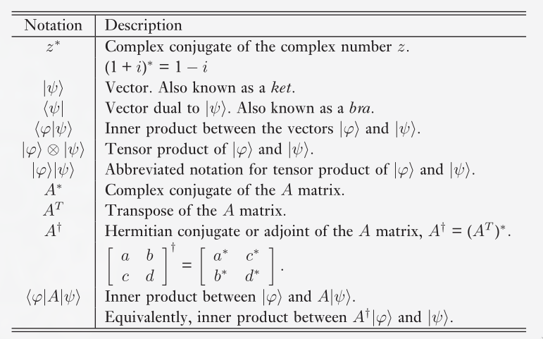
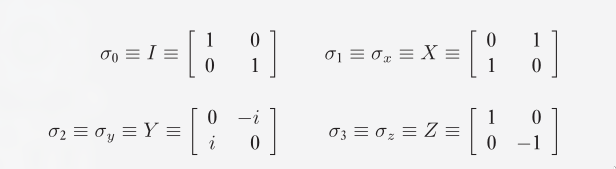

Our project covers Shor's algorithm, a famous algorithm that
can perform the factorization of a composite number in polynomial
time in the size of its input. Shor's algorithm has a severe implications
in the world of cryptography, specifically for the RSA encryption standard,
which relies on the difficulty of factoring large numbers quickly on a
classical computer to encrypt and secure data.

# Introduction to Quantum Computation

## Qubits

A qubit is different from classical bits in that it can be in a superposition
of the 0 and 1 states. The qubit
$$
\ket{\psi} = \alpha \ket{0} + \beta \ket{1}
$$
upon measurement will collapse to the state $\ket{0}$ with probability $|\alpha|^2$
and to the state $\ket{1}$ with probability $|\beta|^2$. $\alpha$ and $\beta$
are complex numbers such that $|\alpha|^2 + |\beta|^2 = 1$.

Note that after the measurement, the system's state **is** the measured state.
At first glance it might seem like we only care about the measured probability,
but the reason we model the system like this is because different
superpositions evolve in different ways, even if they may give the same
probability function for the $\ket{0}$ and the $\ket{1}$ state.

## Hadamard gate

Consider two qubits as such:
$$
\begin{aligned}
	\ket{+} &= \frac{1}{\sqrt{2}} (\ket{0} + \ket{1}) \\
	\ket{-} &= \frac{1}{\sqrt{2}} (\ket{0} - \ket{1}) \\
\end{aligned}
$$
The **Hadamard gate**, $H$, has the following function on their states
$$
\begin{aligned}
	H \ket{+} &\rightarrow \ket{0} \\
	H \ket{-} &\rightarrow \ket{1} \\
\end{aligned}
$$

## Bell state

Quantum entanglement is a fascinating phenomena where two qubits can seemingly
change each other's states just by being observed. As soon as one qubit is
measured, it collapses to a certain state. Seemingly instantaneously, the other
qubit also collapses to the exact same state. Such a pair of qubits is said to
be entangled. Interestingly, the two qubits need not be in proximity to each
other.

This demonstrates how states with the same measurement outcome probabilities
actually behave differently.
We can represent two entangled qubits with the Bell state.
$$
\ket{\Phi^{+}} = \frac{1}{\sqrt{2}}(\ket{00} + \ket{11})
$$

Each of the two qubits here is in an equal superposition of the $\ket{0}$ and the
$\ket{1}$ states.

## Prerequisite Linear Algebra

We are interested in vector spaces, specifically $\mathbb{C}^n$, the vector
space of n-tuples of complex numbers. Though we will occasionally use column
matrix notation, most commonly *ket* notation ($\ket{\psi}$) is used to
represent vectors. A notable exception is the zero vector, which is represented
directly by 0, not $\ket{0}$, since the second typically already has a different
meaning.
The field we associate with this space will also be complex field, i.e.
complex numbers will be the scalars that we consider.

We will mostly be concerned with finite dimensional vector spaces.
In linear algebra, we predominantly deal with linear operators from
one vector space to another vector space, (often they are from one vector
space to the same vector space) represented as matrices.
Here we shall occasionally see them in this form, but it is important
to remember that matrix representations are the same as the abstract
concept of the linear operators, only grounded in a specific input and output
basis pair.

### Pauli matrices

The Pauli matrices are very useful $2 \times 2$ matrices

The identity matrix is sometimes not considered, giving
just $X$, $Y$, and $Z$ as the Pauli matrices.

## Inner Product

A function $(\cdot, \cdot)$ from $V \cross V$ to $\mathbb{C}$ is an inner product if
it satisfies the requirements that:

1) $(\cdot, \cdot)$ is linear in the second argument,
$$
\left( \ket{v}, \sum_{i} \lambda_i \ket{w_i} \right) = \sum_{i} \lambda_i (\ket{v}, \ket{w_i})
$$
   Note that this implies that the function is anti-linear in its first
   argument as well, i.e. scalars taken out of the function in the first
   argument come out as their conjugates.

2) $\left( \ket{v}, \ket{w} \right)$ = $\left( \ket{w}, \ket{v} \right)^{*}$

3) $\left( \ket{v}, \ket{v} \right) \geq 0$ with equality iff $\ket{v} = 0$

We define the inner product on $\mathbb{C}^{n}$ as
$$
\braket{y}{z} \equiv (y, z) \equiv \sum_{i} {y_i}^{*} z_i \equiv
\begin{bmatrix}
{y_1}^{*} & ... & {y_n}^{*} \\
\end{bmatrix}
\begin{bmatrix}
z_1 \\
\vdots \\
z_n \\
\end{bmatrix}
$$

A vector space with an inner product defined on it is called an inner product space.
With respect to finite dimensional complex vector spaces, **Hilbert spaces** are the
same as inner product spaces.

The concepts of orthogonality, norms, unit vectors etc. all apply.

## Outer Product Representation

Linear operators can be represented using the inner product in a representation
called the *outer product representation* (you read that correctly, the outer
product representation makes use of the inner product).

Let $\ket{v} \in V, \ket{w} \in W$, where $V, W$ are inner product spaces.
Then $\ketbra{w}{v}$ is defined by
$$
(\ketbra{w}{v})(\ket{v'}) \equiv \ket{w} \braket{v}{v'} = \braket{v}{v'} \ket{w}
$$
We can consider the operator $\ketbra{w}{v}$ acting on $\ket{v'}$, to be the same
as multiplying (scaling) $\ket{w}$ with the complex number (scalar) $\braket{v}{v'}$.

Note that this means the output space must be $W$, however we view it,
and since $v' \in V$, the input space is $V$. This makes intuitive sense since
this is a representation for a linear operator.

### Completeness relation

The reason we care about the outer product notation will become clearer
upon seeing the *completeness relation* for orthonormal vectors.

Let $\ket{i}$ by any orthonormal basis for $V$. Note, $\braket{i}{v} = v_i$.
$$
\left( \sum_{i} \ketbra{i}{i} \right) \ket{v} = \sum_{i} \ket{i} \braket{i}{v}
= \sum_{i} v_i \ket{i} = \ket{v}
$$

This last relation holds for every $\ket{v} \in V$, which implies that
$$
\sum_{i} \ketbra{i}{i} = I
$$

<!-- TODO: Why do we want to represent linear operators in outer product notation again? -->
Now, one reason why this completeness relation is useful is because it can be
applied to represent any linear operator in the outer product notation.

Consider a linear operator $A: V \rightarrow W$, and $\ket{v_i}$ as an orthonormal
basis for it $V$, $\ket{w_j}$ for $W$. We have
$$
\begin{aligned}
A &= I_{W} A I_{V} \\
&= \sum_{ij} \ket{w_j} \langle w_j | A | v_i \rangle \bra{v_i} \\
&= \sum_{ij} \langle w_j | A | v_i \rangle \ket{w_j} \bra{v_i} \\
\end{aligned}
$$

This is the outer product representation for the linear operator $A$.

### Cauchy-Schwarz inequality

Consider two vectors $\ket{v}, \ket{w}$ in a Hilbert space. According
to the Cauchy-Schwarz inequality, we have
$$
|\braket{v}{w}|^2 \leq \braket{v}{v} \braket{w}{w}
$$

In order to prove this, let us construct an orthonormal basis
$\ket{i}$ for the vector space. Using the completeness relation, we have
$\sum_{i} \ketbra{i}{i} = I$, and then
$$
\begin{aligned}
\braket{v}{v} \braket{w}{w} &= \braket{v}{Iv} \braket{w}{w} \\
&= \braket{v}{\left( \Sigma_{i} \ketbra{i}{i} \right) v} \braket{w}{w} \\
&= \sum_{i} \braket{v}{(\ketbra{i}{i}) v} \braket{w}{w} \\
&= \sum_{i} \braket{v}{i} \braket{i}{v} \braket{w}{w} \\
&= \bra{v} \left( \frac{\ket{w}}{\sqrt{\braket{w}{w}}} \right) \left (\frac{\bra{w}}{\sqrt{\braket{w}{w}}} \right) \ket{v} \braket{w}{w} + \dots \\
&\geq \frac{\braket{v}{w} \braket{w}{v}}{\braket{w}{w}} \braket{w}{w} \\
&= \braket{v}{w} \braket{w}{v} = |\braket{v}{w}|^2\\
\end{aligned}
$$

## Eigenvectors and eigenvalues

We will commonly refer to $v$ as the eigenvalue for a vector $\ket{v}$ w.r.t
some linear operator A, i.e. $A \ket{v} = v \ket{v}$. Recall that the
characteristic function is given by $c(\lambda) \equiv \text{det}|A - \lambda I |$,
and the eigenvalues of $A$ are the solutions to the characteristic
equation $c(\lambda) = 0$

<!-- Qiskit: https://www.youtube.com/watch?v=mAHC1dWKNYE -->
The eigenvalues of unitary matrices are of the form $e^{i \theta}$,
that is to say that they are complex numbers with norm equal to 1.
Another property to note, is that for two eigenvalues $\lambda_x$ and $\lambda_y$, such
that $\lambda_x \neq \lambda_y$, then the corresponding eigenvectors $\ket{x}, \ket{y}$, must
be orthogonal, i.e $\braket{x}{y} = 0$.

# Shor's algorithm to factorize a number

## Reduction of factoring to order-finding

Given $N$ as a positive integer and $x$ co-prime to $N$, $1 \leq x < N$,
the order of $x$ modulo $N$ is defined as the *least positive* integer
$r$ such that:
$$ x^r \equiv 1 \text{ mod } N $$

Our reduction from factoring to order-finding can be done in two basic steps:

1. Firstly, we show that we can compute a factor of $n$ if we can find
   a non-trivial solution to the equation $x^{2} \equiv 1 \text{ mod } N$, i.e.
   there exists $x$ such that $x \not\equiv \pm 1 \text{ mod } N$.

2. Secondly, we show that for a random $y$ co-prime to $N$, it is highly
   probably that the order of $y$, $r$ is an even number, and $y^{\frac{r}{2}}
   \not\equiv \pm 1 \text{ mod } N$, and thus $x \equiv y^{\frac{r}{2}} \text{
   mod } N$ is a solution to $x^2 \equiv 1 \text{ mod } N$

### Step 1

Now let us suppose we have the non trivial root of $1$ modulo $N$,
then
$$
\begin{aligned}
x^2 &\equiv 1 &\text{ mod } N \\
x^2 - 1 &\equiv 0 &\text{ mod } N \\
(x + 1)(x - 1) &\equiv 0 &\text{ mod } N \\
\end{aligned}
$$

So $N$ divides $(x + 1)(x - 1)$, which means $N$ must have a common factor
with either $(x + 1)$ or $(x + 1)$. Now recall that $x - 1 < x + 1 < N$,
and thus $N$ cannot completely divide either of $(x - 1)$ or $(x + 1)$,
so the common factor that they share must be a factor of $N$ as well.

<!-- How to guarantee that at least one of gcd gives a non-trivial factor? -->
Thus, we can use Euclid's algorithm to compute $\text{gcd}(x - 1, N)$,
and $\text{gcd}(x + 1, N)$, obtaining a non-trivial factor of $N$.
This is done in $O(log^3(N))$ time. Why is this the complexity?

There are a maximum of $log(N)$ steps in the Euclidean algorithm, each
involving the division of one number by another, and the computation of
a remainder. Thus, each step takes $log^2(N)$ time itself, for a total of
$O(L^3)$ time complexity, where $L = log(N)$.

### Step 2

This step itself can be further broken down as such:

- First, we show that for the group $Z_{p^{\alpha}}^{*}$, there exists a generator.

- Next, we show that if we have the greatest number $2^{d}$ which divides
  $\varphi(p^{\alpha})$, then it divides the order of a of a random number in
  the previously mentioned group with probability $\frac{1}{2}$.

- Next we show that the for the prime factorization of an odd composite natural
  number, there is a high probability that a randomly chosen number from
  $Z_{N}^{*}$ has an even order mod $N$.

Let us proceed to formally state the first of these statements.

### Lemma 1
Let $p$ be an odd prime, $\alpha$ a natural number. Then the group
$Z_{p^\alpha}^{*}$ is cyclic.

### Proof

We state this lemma without proof.

#### Lemma 2
Let $p$ be an odd prime, and $2^d$ be the largest power of 2 dividing
$\varphi(p^\alpha)$, where $\varphi$ is Euler's totient function. Then with
probability one-half, $2^d$ divides the order, modulo $p^\alpha$ of a random
element of $Z_{p^\alpha}^{*}$

#### Proof
$\varphi$, Euler's totient function counts the numbers from 1 to the given
number, which are co-prime to the given number. It also has a specific
property, that $\varphi(ab) = \varphi(a) \varphi(b)$.

We note $\varphi(p^\alpha) = \varphi(p^{\alpha - 1}) \varphi(p)
= \varphi(p^{\alpha - 1})(p - 1)$, because $p$ is a prime. Since $p$ is also
odd, $p - 1$ must be even, and as a result, $d \geq 1$.

Now, from the previous lemma, we know that there exists a generator $g$ for
$Z_{p^\alpha}^{*}$, since it is a cyclic group. We already know that there
must be $\varphi(p^\alpha)$ elements in the group. Since the order of an element in
the finite cyclic group cannot exceed the number of elements in it,
an arbitrary element in the group can be written as $g^{k}$, for some
$k$ in the range of 1 to $\varphi(p^{\alpha})$.

Let $r$ be the order of $g^{k} \text{ mod } p^{\alpha}$, and consider
two possible cases:

i. $k$ is odd. Then $g^{kr} \equiv 1 \text{ mod } p^{\alpha}$ implies that the
   number of the elements in the group i.e. $\varphi(p^{\alpha})$ must divide
   $kr$, <!-- Why? This is order of the group. (that doesn't make sense) --> and
   thus $2^d$ must divide $kr$, and since $k$ is odd, it contains no powers of
   2 in its prime factorization, i.e. $2^d$ must divide $r$. 

ii. $k$ is even. Then
$$
\begin{aligned}
g^{\frac{\varphi(p^{\alpha})}{2} k} &=
\left(g^{\varphi(p^{\alpha})}\right)^{\frac{k}{2}} \\
	&= 1 ^{\frac{k}{2}}\\
	&= 1 \text{ mod } p^{\alpha}\\
\end{aligned}
$$
which in turn implies that $r$ must divide $\varphi(p^{\alpha})/2$, since $r$
is by definition the least natural number such that $g^{kr} \equiv 1 \text{ mod
} p^{\alpha}$. This implies that $2^d$ does not divide $r$.

We can see this by noting that $\varphi(p^{\alpha})/2 = 2^{d-1} \cdot c_0$,
where $c_0$ is some odd constant. Then since $r$ divides $\varphi(p^{\alpha})$,
if $r = 2^b \cdot c_1$, where $2^b$ is the highest power of 2 that
divides $r$  and $c_1$ is another odd constant, then $b \leq (d - 1)$,
since otherwise $r$ would not be able to divide $\varphi(p^{\alpha})$.
This means that $2^d$ cannot divide $r$.

Note that in this manner, dependent on whether $k$ is odd or even,
we were able to predict whether or not $2^d$ divides the order $r$, of
an arbitrary element $g^k$ in the group.

All of this together means that $Z_{p^{\alpha}}^{*}$ can be cleanly partitioned
into two sets of equal size. The first are $g^k$ with odd $k$, for which $2^d$
divides $r$, and the second are $g^k$ with even $k$, for which $2^d$ does not
divide $r$. Thus, for a randomly chosen element in the group,
with probability $\frac{1}{2}$, the integer $2^d$ divides the order $r$ of the
element.

However, this was stated for the group $Z_{p^{\alpha}}^{*}$, so
how is it useful for the composite number which we are trying to consider?
For this we move on to our next lemma.

#### Lemma 3
Let $N = p_1^{\alpha_1} p_2^{\alpha_2} \dots p_m^{\alpha_m}$, where $p_i$'s are all
distinct primes. Then if we choose an arbitrary $x$ from $Z_{N}^{*}$,
with order $r$ modulo $N$, we have
$$
P(r \text{ is even and } x^{\frac{r}{2}} \not\equiv \pm 1 (\text{ mod } N)) \geq 1 - \frac{1}{2^m}
$$

#### Proof
Let us prove instead, the following, equivalent statement (we can see that the
statements are equivalent by a clever application of De Morgan's law):
$$
P(r \text{ is odd or } x^{\frac{r}{2}} \equiv \pm 1 (\text{ mod } N)) \leq \frac{1}{2^m}
$$

From the Chinese remainder theorem, there is one and only one $x$ modulo $N$,
such that $x \equiv x_j (\text{ mod } p_{j}^{\alpha_j})$ for each $j$, since
the numbers $p_{j}^{\alpha_j}$ are all obviously pairwise co-prime.
Thus, it is equivalent to chose the sequence of $x_j$ independently from $Z_{p_{j}^{\alpha_j}}^{*}$, or to choose a single $x$ from $N$.

Now, let $r_j$ be the order of $x_j \text{ mod } p_{j}^{\alpha_j}$, 
$2^{d_j}$ be the largest power of 2 that divides $r_j$,
and $2^d$ be the largest power of 2 that divides $r$.

In order to have $r$ be odd or $x^{\frac{r}{2}} = \pm 1 (\text{ mod } N)$, all
$d_j$ must be equal to each other for all $j$.

We can see this by breaking it down into two cases:

- $r$ is odd. Since each $r_j$ divides $r$,
<!-- Why? -->
  since $r$ is odd, it follows that each $r_j$ must also be odd.
  As a result, there will be no power of 2 that will divide any $r_j$,
  i.e $d_j = 0$ for all $j$.

- $r$ is even, and $x^{\frac{r}{2}} \equiv \pm 1 (\text{ mod } N)$.
  In this case, $x^{\frac{r}{2}} \equiv \pm 1 (\text{ mod } p_{j}^{\alpha_j})$.
  We can see this because $x^{\frac{r}{2}} \pm 1 \equiv 0 \text{ mod } N$,
  which means $N$ divides $x^{\frac{r}{2}} \pm 1$. Now,
  $p_{j}^{\alpha_j}$ in turn divides $N$, and thus
  $p_{j}^{\alpha_j}$ divides $x^{\frac{r}{2}} \pm 1$, and finally,
  $x^{\frac{r}{2}} \equiv \pm 1 (\text{ mod } p_{j}^{\alpha_j})$.

  Thus, $r_j$ does not divide $\frac{r}{2}$, but $r_j$ did indeed divide
  $r$. The only way this is possible is if $d_j = d$ for all $j$.
<!-- HUH?? -->

The probability of all these values $d_j$ being the same, is at most $\frac{1}{2^m}$.
We can see this from lemma 2.
<!--I sure can't -->

# Quantum Fourier Transform 

The Quantum fourier Transform uses the same matrix as the Discrete fourier transform. 

To formally define the Discrete fourier transform: 

For a vector $(\alpha_0, \alpha_1, \cdots, \alpha_{N-1})$, the out is another vector $(\beta_0, \beta_1, \cdots, \beta_{N-1})$ such that 

$$
\beta_j = \frac{1}{\sqrt{N}}\sum _{k=0} ^{N-1} \omega ^{jk}  \alpha_k
$$

where $\omega$ is the $N^{th}$ root of $1$ i.e. $\omega = e^{\frac{2 i\pi}{N}}$

The QFT (Quantum Fourier Transform) can be said to be the same matrix, just operating on the quantum computational basis.

i.e. the $QFT_N$ can be formally defined as (for $N = 2^n$): 

where $|k \rangle$ and $|j \rangle$ are computational basis vectors 

the transform: 

$$
|k \rangle \xrightarrow{QFT_{2^n}} \frac{1}{\sqrt{N}}\sum _{j=0} ^{2^n-1} \omega ^{kj} |j \rangle
$$

Where $\omega$ is the $N^{th}$ root of unity that is $\omega = e^{\frac{2 i\pi}{N}}$

As is visible right now, QFT is basically an application of the DST on the computational basis.

## Relevant properties 

There are three primary properties of the QFT that will be relevant to our purpose of solving the period-finding sub-problem in the Shor's algorithm. 

1. It is unitary and that implies we can make a quantum circuit corresponding to it. 
2. Two vectors that are just linearly shifted from each other will be transormed into two vectors that differ just in the _phase_ (formal definition and proof has been provided later in the document)
3.  Periodicity relation: suppose the input vector is periodic with $r$ then the output vector is periodic with $\frac{N}{r}$

### Property 1 

Let the $QFT_N$ matrix be referred to as $Q$

Required to prove: 

$$
Q \cdot Q ^{\dagger} = I
$$

Let us consider the LHS

and let $\alpha_{jk}$ be the element on the $j^{th}$ row and the $k^{th}$ column (indexed from $0$)

thus: 

$$
\begin{aligned}
    \alpha _{jk} &= \frac{1}{N} \cdot \sum _{l=0} ^{N-1} \omega ^{jl} \cdot \overline{\omega^{lk}} \\
    &= \frac{1}{N} \cdot \sum _{l=0} ^{N-1} \omega ^{jl - lk} \\
    &= \frac{1}{N} \cdot \sum _{l=0} ^{N-1} \omega ^{l(j - k)}
\end{aligned}
$$

This leads us to two cases:

Case 1:

$j=k$

thus the summation becomes: 

$$
\begin{aligned}
    \alpha_{jk} &= \frac{1}{N} \cdot \sum _{l=0} ^{N-1} \omega ^{l(j - k)} \\
    &= \frac{1}{N} \sum _{l=0} ^{N-1} \omega^0 \\
    &= \frac{1}{N} \sum _{l=0} ^{N-1} 1 \\
    &= 1
\end{aligned}
$$

Case 2:

$j \not = k$

thus summation becomes: 

$$
\begin{aligned}
    \alpha_{jk} &= \frac{1}{N} \cdot \sum _{l=0} ^{N-1} \omega ^{l(j - k)} \\
    &= \frac{1}{N} \sum _{l=0} ^{N-1} \omega^{j-k} \omega^l \\
    &= \frac{\omega^{j-k}}{N} \sum _{l=0} ^{N-1} \omega ^l \\
    & \text{ the summation is a geometric series} \\
    &= \frac{\omega^{j-k}}{N} \cdot \frac{1 - \omega ^N}{1 - \omega} \\
    & \text{We know: } \omega^N = 1 \\
    &= 0
\end{aligned}
$$

Therefore to summarize, we can say $\alpha_{jk}$ can be described with this function: 

$$
\alpha_{jk} = 
\begin{cases}
    1 & k=j \\
    0 & \text{otherwise }
\end{cases}
$$

and this describes a $I$ matrix. 

Therefore, LHS = $I$ 

LHS = RHS 

Hence proved.

 

### Property 2 

Simply put, we can say a linear shift of state vector will cause a relative phase shift in it's transform. 

What is linear shift of a vector? 

These two vectors: 

$$
\begin{bmatrix}
    \alpha_0 \\ 
    \alpha_1 \\
    . \\
    . \\
    \alpha_{N-1}
\end{bmatrix}
,
\begin{bmatrix}
    \alpha_{N-1} \\ 
    \alpha_0 \\
    . \\
    . \\
    \alpha_{N-2}
\end{bmatrix}
$$

are linearly shifted by $1$ place.

In other words, in terms of probability of what the state will collapse to once measured is the same before and after the QFT transform. 

Proof: 

considering a $N = 2^n$ state system ($n$ qubits )

Let us consider a vector of the form: 

$$
\begin{bmatrix}
    \alpha _0 \\
    \alpha _1 \\
    . \\
    . \\
    . \\
    \alpha _{N-1}
\end{bmatrix}
$$

and let us also say that: 

$$
\begin{bmatrix}
    \alpha _0 \\
    \alpha _1 \\
    . \\
    . \\
    . \\
    \alpha _{2^n-1}
\end{bmatrix}
\xrightarrow{QFT_{2^n}}
\begin{bmatrix}
    \beta_0 \\
    \beta_1 \\
    . \\
    . \\
    . \\
    \beta_{2^n - 1}
\end{bmatrix}
$$

In other words, we have that: 

$$
\beta_j = \frac{1}{\sqrt{2^n}}\sum _{k=0} ^{2^n-1} \omega ^{jk}  \alpha_k \forall j \in \{0, 1, \cdots 2^n -1 \}
$$

where $\omega = e^{\frac{2 i\pi}{2^n}}$

For convenience, I will be using $N$ instead of $2^n$ for now:

Now, let us consider a linearly shifted vector that is shifted by some constant $c$

this vector is therefore: 

$$
\begin{bmatrix}
    \alpha _{(0 + c \mod{N})} \\
    \alpha _{(1 + c \mod{N})} \\
    . \\
    . \\
    \alpha_{N-1} \\
    \alpha_0 \\
    . \\
    . \\
    \alpha_{(N-c)}
\end{bmatrix}
$$

without loss of generality, we can assume $c < N$ 

if the $k^{th}$ row of this vector is referred to as the $\alpha' _k$ then 

$$
\alpha' _k = \alpha _{(k+c) \mod N}
$$

Now, say that: 

$$
\begin{bmatrix}
    \alpha'_0 \\
    \alpha'_1 \\
    . \\
    . \\
    \alpha'_{N-1}
\end{bmatrix}
\xrightarrow{QFT_N}
\begin{bmatrix}
    \beta' _0 \\
    \beta' _1 \\
    . \\
    . \\
    \beta' _{N-1}
\end{bmatrix}
$$

and from the definition of QFT, we get 

$$
\beta'_j = \frac{1}{\sqrt{N}}\sum _{k=0} ^{N-1} \omega ^{jk}  \alpha'_k \forall j \in \{0, 1, \cdots N -1 \}
$$

Now, working on the term for an arbitrary $j \in \{0, 1, 2, \cdots N\}$

$$
\begin{aligned}
    \beta'_j &= \frac{1}{\sqrt{N}}\sum _{k=0} ^{N-1} \omega ^{jk}  \alpha'_k \\
    &= \frac{1}{\sqrt{N}} \sum _{k=0} ^{N-1} \omega ^{jk}  \alpha_{(k+c) \mod{N}} \\
    &= \frac{1}{\sqrt{N}} \sum _{k=0} ^{N-1} \omega ^{jk+jc} \omega^{-jc}  \alpha_{(k+c) \mod{N}}  \\
    & \text{and since } jc \text{ is a constant, we can say: } \\
    &= \frac{\omega^{jc}}{\sqrt{N}} \sum_{k=0} ^{N-1} \omega ^{j(k+c)} \alpha_{(k+c) \mod{N}} \\
    &= \frac{\omega^{jc}}{\sqrt{N}} \sum_{k=0} ^{N-1} (\omega ^{(k+c)})^j \alpha_{(k+c) \mod{N}} \\
    & \text{Since, we know } \omega^N = 1, \text{We an say: } \omega^x = \omega^{x \mod{N}} \text{, thus: } \\
    &= \frac{\omega^{jc}}{\sqrt{N}} \sum_{k=0} ^{N-1} (\omega ^{(k+c) \mod{N}})^j \alpha_{(k+c) \mod{N}} \\
    &= \frac{\omega^{jc}}{\sqrt{N}} \sum_{k=0} ^{N-1} \omega ^{j((k+c) \mod{N})} \alpha_{(k+c) \mod{N}} 
\end{aligned}
$$

Now, at this point we must note that that the function $f(x) = (x+c) \mod{N} \text{ for some } c \in \mathbb{Z}_N$ is a  **bijection** from $\mathbb{Z}_N \to \mathbb{Z}_N$

which means that due to the commutativity of the summation operation, we can say: 

$$
\sum_{k=0} ^{N-1} \omega ^{j((k+c) \mod{N})} \alpha_{(k+c) \mod{N}} = \sum_{l=0} ^{N-1} \omega ^{jl} \alpha_{l}
$$

We can do the above because the bijeciton takes all the values of $\mathbb{Z}_N$ when $k$ takes all the values of $\mathbb{Z}_N$

Therefore, we can write the last equation as 

$$
\beta' _j = \frac{\omega^{jc}}{\sqrt{N}} \sum_{l=0} ^{N-1} \omega ^{jl} \alpha_{l}
$$

and we know from before that 

$$
\beta _j = \frac{1}{\sqrt{N}} \sum_{k=0} ^{N-1} \omega ^{kl} \alpha_{k}
$$

and thus we have that: 

$$
\beta' _j = \omega^{jc} \beta _j
$$

and this is valid for all $j$ and therefore we can say that the outputs of the QFT of two linearly shifted vectors differ only in relative phase. 

Hence proved. 

As mentioned before, the reason this is so significant is that when we sample the outputs of the QFT, our observations will be the same for linearly shifted vectors because the relative phase difference can't manifest itself in the probability (because $|\omega^{jc}|^2 = 1$ and it is multiplied to the terms of the summation of the probability expression)

## Property 3

A vector with period $r$ will lead to a vector with period $\frac{N}{r}$
in this context, when we say period of a vector we mean the periodicity of the coefficients for example $\alpha_1 = \alpha_3 = \alpha_5 \cdots$ and $\alpha_0 = \alpha_2 = \alpha_4 \cdots$ then the period is $2$

Note: we won't be proving this property for the general case but for the specific case required for Shor's algorithm. 

When QFT is to be used in the Shor's algorithm, we can expect the elements of the row vector to be: 

$$
\alpha_j  =
\begin{cases}
    \sqrt{\frac{r}{N}} & j \equiv a_0 \mod {r} \\
    0 & \text{ otherwise}
\end{cases}
$$

where $\alpha_i$ is the element at the $i^{th}$ row 

and $a_0$ is some offset 

Now, say $N \mod {r} = 0$, in that case we can easily make the claim that the following vector: 

$$
\alpha'_j  =
\begin{cases}
    \sqrt{\frac{r}{N}} & j \equiv 0 \mod {r} \\
    0 & \text{ otherwise}
\end{cases}
$$

is basically the old vector shifted by an offset of $a_0$. We know from the previous proven property that the only difference in the output will be that of relative phases. 

This implies that all the rows that would be $0$ in the output of the old vector will continue to be $0$ and the same stands for the non-zero values. This means that the output of both the vectors will have the same periodicity. 
% more clarification needed

So if we prove our claim for the output of the second vector, we will have proved it for the first vector as well. 

Let $\beta' j$ be the value at the $j^{th}$ row for the output of the second vector 

$$
\begin{aligned}
    \beta' _j &= \sqrt{\frac{1}{N}} \sum _{k=0} ^{N-1} \omega ^{jk} \alpha' _k \\
    & \text{We know that } \alpha' _k = 0 \ \forall \ k \not \equiv 0 \mod{r} \\
    & \text{Therefore, we introduce a new parameter l, such that } l = \frac{k}{r}  \\
    & \text{Note: } l \text{ is an integer } \\
    &= \sqrt{\frac{1}{N}} \sum _{l=0} ^{\frac{N}{r} - 1} \omega ^{jrl} \alpha' _{jrl} \\
    & \text{since } jrl  \equiv  0 \mod{r}, \text{ we have } \alpha' _{jrl} = \sqrt{\frac{r}{N}} \\
    &= \frac{\sqrt{r}}{N} \sum _{l=0} ^{\frac{N}{r} - 1} \omega ^{jrl}
\end{aligned}
$$

The last summation is actually that of a geometric series, therefore we can say: 

$$
\beta' _j = \frac{\sqrt{r}}{N} \cdot \frac{\omega^{jN} - 1}{\omega^{jr} - 1}
$$

Since $\omega ^N = 1$, the numerator is always $0$ 

and in cases when $jr \equiv 0 \mod{N}$ the denominator is also $0$ and in such cases, we calculate the limit using the L' Hospital rule 

$$
\begin{aligned}
    \lim _{j \to k \frac{N}{r}} \beta' _k &= \lim _{j \to k \frac{N}{r}} \frac{\sqrt{r}}{N} \cdot \frac{\omega^{jN} - 1}{\omega^{jr} - 1} \\
    &= \frac{\sqrt{r}}{N} \cdot \lim _{j \to k \frac{N}{r}} \frac{\omega^{jN} - 1}{\omega^{jr} - 1} \\
    &= \frac{\sqrt{r}}{N} \cdot \lim _{j \to k \frac{N}{r}} \frac{\frac{2 \pi i N}{N}}{\frac{2 \pi ir}{N}} \cdot \frac{\omega ^{jN}}{\omega ^{jr}} \\
    &= \frac{\sqrt{r}}{N} \frac{N}{r}  \\
    &= \frac{1}{\sqrt{r}}
\end{aligned}
$$

Therefore, we can say that 

$$
\beta' _j = 
\begin{cases}
    \frac{1}{\sqrt{r}} & j \equiv 0 \mod{\frac{N}{r}} \\
    0 & \text{otherwise }
\end{cases}
$$

Therefore, we can say that the vector $\beta'$ (formed by the equation of $\beta' _j$) is periodic with $\frac{N}{r}$ therefore so is the vector $\beta$ (formed by the equation of $\beta_j$)

Hence proved. 

# Period finding using QFT

We first define the function 

$$
f(a) = x^a \mod{N}
$$

where $N$ is what we're trying to factorize and. 

We need to find the period of this function. 

The period finding problem is what is solved exponentially better by a quantum circuit. 

Let $n = \log _2 N$

The input register has $2n$ qubits and the output register has $n$ qubits.

in other words, we can say that 

$$
f: \{0, 1\}^{2n} \to \{0,1\}^n
$$

We know that a unitary matrix $U_f$ can be constructed such that 

$$
|j \rangle \otimes | 0 \rangle \xrightarrow{U_f} |j \rangle \otimes |f(j) \rangle
$$

where $j \in Z_{2^{2n}}$ and $| j \rangle$ therefore refers to the computational basis. 

Now, we begin with a state where all the collapse possiblities are equi-probable 

i.e. our starting state is: 

$$
\frac{1}{\sqrt{2^{2n}}}  \sum_{j=0} ^{2^{2n}-1} |j \rangle \otimes |0\rangle
$$

and we apply $U_j$ on this:

$$
\left(\sum_{j=0} ^{2^{2n}-1} |j \rangle \otimes |0\rangle \right) \cdot U_f 
$$

Thus we have:

$$
\begin{aligned}
    \Big ( \frac{1}{\sqrt{2^{2n}}} \sum_{j=0} ^{2^{2n}-1} |j \rangle \otimes |0\rangle \Big) \cdot U_f  &= \frac{1}{\sqrt{2^{2n}}} \sum_{j=0} ^{2^{2n}-1} \Big ( |j \rangle \otimes |0\rangle \Big) \cdot U_f \\
    &= \frac{1}{\sqrt{2^{2n}}} \sum_{j=0} ^{2^{2n}-1} |j \rangle \otimes |f(j) \rangle
\end{aligned}
$$

Note: the above expressions have been written in the form of tensor product of one $2n - bit$ register and another $n-bit$ register. 

Also note that each $|j \rangle$ is a computational basis vector. 

Therefore, the $n-bit$ register gets the output of the function (this works with the constraints of the co-domain we defined for $f$)

and the input is retained. 

Here the output register is measured and this leads to two things: 

- a full collapse of the output register to exactly one state 
- a partial collapse of the input register to a superposition of states that are consistent with the output. 

When we measure the output register, the state will collapse i.e. all but one values in the vector will become $0$ and the non-zero place will be $1$ (this signifies a certainty as the state has collapsed)

Suppose after the measurement of the output register, we see that it has collapsed to $f(a_0)$ 

since we know that it the function is periodic with $r$ we have that

$$
f(a_0) = f(a_0 + r) = f(a_0 + 2r) \cdots 
$$

without loss of generality we can say $a_0 \leq 2^n$ 

we know that all the states $|j \rangle \otimes |f(j) \rangle$ such that $f(j) \not = f(a_0)$  have a coefficient $0$ 

Thus the total state becomes: 

$$
\begin{aligned}
    & \sqrt{\frac{r}{2^{2^n}}} \sum _{l=0} ^{\frac{2^{2^n}}{r} - 1} |a_0 + lr \rangle \otimes |f(a_0) \rangle \\
    & \text{ By distribution, we have: } \\
    & \Biggl[ \sqrt{\frac{r}{2^{2^n}}} \sum _{l=0} ^{\frac{2^{2^n}}{r} - 1} |a_0 + lr \rangle  \Biggr] \otimes |f(a_0) \rangle
\end{aligned}
$$

We can look look at the state of the input register independently now (as we can take output registers state out)

$$
\sqrt{\frac{r}{2^{2^n}}} \sum _{l=0} ^{\frac{2^{2^n}}{r} - 1} |a_0 + lr \rangle
$$

Here we reach a very interesting point at the algorithm. If we measure the state now, it will randomly collapse to any one of the possibilities and that won't give us much useful information. 

Hypothetically if we had several runs, and suppose the next run the output register collapses to $f(b_0)$ and we'd have in the input register:

$$
\sqrt{\frac{r}{2^{2^n}}} \sum _{l=0} ^{\frac{2^{2^n}}{r} - 1} |b_0 + lr \rangle
$$

Notice that if we look at the state obtained from two different runs as vectors we notice that they're simply linear shifted versions of each other. 

Means every time we run the algorithm, we will get a linearly shifted periodic vector with the same period everytime. 

Here, we use the extremely handy properties of the Quantum fourier Transform (mentioned earlier) namely: 

- Two vectors that are just linearly shifted from each other will be transformed into two vectors that differ just in the _phase_ (formal definition and proof has been provided later in the document)
-  Periodicity relation: suppose the input vector is periodic with $r$ then the output vector is periodic with $\frac{2^n}{r}$

Since every new run gives us a linearly shifted vector (all of which have the same period), we can apply QFT on all of at the end of the run to get a set of vectors that are _not linearly shifted_ and differ only in relative phase. 

The good thing about relative phase is that it does not manifest itself in the probability of the final collapsed stated. 

In other words at the end of each run, we will have 

$$
\sqrt{\frac{r}{2^n}} \sum _{l=0} \phi_l |lr \rangle
$$

where $\phi_l$ depends on the offset and the state but we can be assured that $|\phi _l|^2 = 1$ 

therefore, it has no effect on the probability of us observing a particular state on measurement. 

therefore at the end of each run (including the measurement) we will key $k \frac{2^n}{r}$ where $k$ is some constant 

getting the GCD across the runs will get us a multiple of $\frac{2^n}{r}$ 

If $r$ does not divide $2^n$ then we will have an approximation. 

this method gives us the period and solves the period finding sub-problem. 

# Wrapping it up 

Here, some finer points will be discussed in passing because the implementation of the algorithm on actual circuit is not in the scope of this document. 

When discussing time complexity of Quantum circuits, it makes sense to consider certain elementary gates as unit-time operations. The more complicated quantum circuits like the QFT and the $U_f$ mentioned above are constructed using said elementary gates. And that is where the implementation becomes important 

First order of business is to consider the $U_f$ that is the unitary transformation corresponding to the modular exponentiation function $f$ 

$$
f(a) = x^a \mod{N}
$$

this can be written as:

$$
f(a) = (x^{2^0}) ^{a_0} (x^{2^1})^{a_1} \cdots \mod{N}
$$

where $a_0, a_1 \cdots$ represents the binary representation of $a$ from the LSB to the MSB 

The unitary transformation corresponding to this: 

$$
|j \rangle \otimes |0 \rangle \xrightarrow{U_f} |j \rangle \otimes |f(j) \rangle
$$

This unitary transformation corresponding to above is considered the most resource intensive part of the Shor's algorithm. There are several popular implementation most of which use an array of quantum accumulator and multipliers. Like a digital circuit, the gate depth determines the time complexity. 

But on the average we can say that the period finding algorithm requires modular multiplication circuits $U_b$ for 

$$
b= x, x^2, x^4 \cdot a^{2p}
$$

where $\log _2 (N^2) = 2p$

why? because we will actually be implementing the second representation of the function $f$

Each controlled modular multiplication operation requires a quantum circuit of size $\log_2 ^2 N$

And in general the number of samples required for the algorithm (the period finding part required several sample, if you recall) scales with the $\log_2 (N)$

therefore the complexity of the overall algorithm this $\log _2 ^3 (N)$

or if the input is $d$ bits then $d^3$

