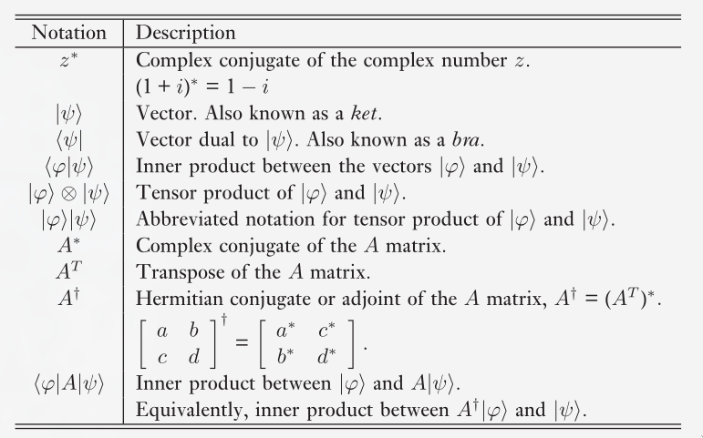
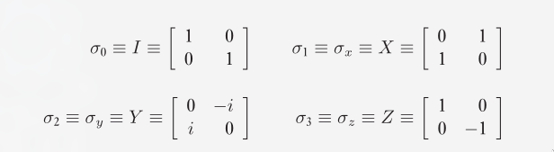

<!-- Primarily using slides from
<https://www.cl.cam.ac.uk/teaching/1920/QuantComp/materials.html>,
and with Nielsen and Chuang as a reference book -->

## Qubits

A qubit is different from classical bits in that it can be in a superposition
of the 0 and 1 states. The qubit
$$
\ket{\psi} = \alpha \ket{0} + \beta \ket{1}
$$
upon measurement will collapse to the state $\ket{0}$ with probability $|\alpha|^2$
and to the state $\ket{1}$ with probability $|\beta|^2$. $\alpha$ and $\beta$
are complex numbers such that $|\alpha|^2 + |\beta|^2 = 1$.

Note that after the measurement, the system's state **is** the measured state.
At first glance it might seem like we only care about the measured probability,
but the reason we model the system like this is because different
superpositions evolve in different ways, even if they may give the same
probability function for the $\ket{0}$ and the $\ket{1}$ state.

## Hadamard gate

Consider two qubits as such:
$$
\begin{aligned}
	\ket{+} &= \frac{1}{\sqrt{2}} (\ket{0} + \ket{1}) \\
	\ket{-} &= \frac{1}{\sqrt{2}} (\ket{0} - \ket{1}) \\
\end{aligned}
$$
The **Hadamard gate**, $H$, has the following function on their states
$$
\begin{aligned}
	H \ket{+} &\rightarrow \ket{0} \\
	H \ket{-} &\rightarrow \ket{1} \\
\end{aligned}
$$

## Bell state

Quantum entanglement is a fascinating phenomena where two qubits can seemingly
change each other's states just by being observed. As soon as one qubit is
measured, it collapses to a certain state. Seemingly instantaneously, the other
qubit also collapses to the exact same state. Such a pair of qubits is said to
be entangled. Interestingly, the two qubits need not be in proximity to each
other.

This demonstrates how states with the same measurement outcome probabilities
actually behave differently.
We can represent two entangled qubits with the Bell state.
$$
\ket{\Phi^{+}} = \frac{1}{\sqrt{2}}(\ket{00} + \ket{11})
$$

Each of the two qubits here is in an equal superposition of the $\ket{0}$ and the
$\ket{1}$ states.

## Prerequisite Linear Algebra

We are interested in vector spaces, specifically $\mathbb{C}^n$, the vector
space of n-tuples of complex numbers. Though we will occasionally use column
matrix notation, most commonly *ket* notation ($\ket{\psi}$) is used to
represent vectors. A notable exception is the zero vector, which is represented
directly by 0, not $\ket{0}$, since the second typically already has a different
meaning.
The field we associate with this space will also be complex field, i.e.
complex numbers will be the scalars that we consider.

We will mostly be concerned with finite dimensional vector spaces.
In linear algebra, we predominantly deal with linear operators from
one vector space to another vector space, (often they are from one vector
space to the same vector space) represented as matrices.
Here we shall occasionally see them in this form, but it is important
to remember that matrix representations are the same as the abstract
concept of the linear operators, only grounded in a specific input and output
basis pair.

### Pauli matrices

The Pauli matrices are very useful $2 \times 2$ matrices

The identity matrix is sometimes not considered, giving
just $X$, $Y$, and $Z$ as the Pauli matrices.

## Inner Product

A function $(\cdot, \cdot)$ from $V \cross V$ to $\mathbb{C}$ is an inner product if
it satisfies the requirements that:

1) $(\cdot, \cdot)$ is linear in the second argument,
$$
\left( \ket{v}, \sum_{i} \lambda_i \ket{w_i} \right) = \sum_{i} \lambda_i (\ket{v}, \ket{w_i})
$$
   Note that this implies that the function is anti-linear in its first
   argument as well, i.e. scalars taken out of the function in the first
   argument come out as their conjugates.

2) $\left( \ket{v}, \ket{w} \right)$ = $\left( \ket{w}, \ket{v} \right)^{*}$

3) $\left( \ket{v}, \ket{v} \right) \geq 0$ with equality iff $\ket{v} = 0$

We define the inner product on $\mathbb{C}^{n}$ as
$$
\braket{y}{z} \equiv (y, z) \equiv \sum_{i} {y_i}^{*} z_i \equiv
\begin{bmatrix}
{y_1}^{*} & ... & {y_n}^{*} \\
\end{bmatrix}
\begin{bmatrix}
z_1 \\
\vdots \\
z_n \\
\end{bmatrix}
$$

A vector space with an inner product defined on it is called an inner product space.
With respect to finite dimensional complex vector spaces, **Hilbert spaces** are the
same as inner product spaces.

The concepts of orthogonality, norms, unit vectors etc. all apply.

## Outer Product Representation

Linear operators can be represented using the inner product in a representation
called the *outer product representation* (you read that correctly, the outer
product representation makes use of the inner product).

Let $\ket{v} \in V, \ket{w} \in W$, where $V, W$ are inner product spaces.
Then $\ketbra{w}{v}$ is defined by
$$
(\ketbra{w}{v})(\ket{v'}) \equiv \ket{w} \braket{v}{v'} = \braket{v}{v'} \ket{w}
$$
We can consider the operator $\ketbra{w}{v}$ acting on $\ket{v'}$, to be the same
as multiplying (scaling) $\ket{w}$ with the complex number (scalar) $\braket{v}{v'}$.

Note that this means the output space must be $W$, however we view it,
and since $v' \in V$, the input space is $V$. This makes intuitive sense since
this is a representation for a linear operator.

### Completeness relation

The reason we care about the outer product notation will become clearer
upon seeing the *completeness relation* for orthonormal vectors.

Let $\ket{i}$ by any orthonormal basis for $V$. Note, $\braket{i}{v} = v_i$.
$$
\left( \sum_{i} \ketbra{i}{i} \right) \ket{v} = \sum_{i} \ket{i} \braket{i}{v}
= \sum_{i} v_i \ket{i} = \ket{v}
$$

This last relation holds for every $\ket{v} \in V$, which implies that
$$
\sum_{i} \ketbra{i}{i} = I
$$

<!-- TODO: Why do we want to represent linear operators in outer product notation again? -->
Now, one reason why this completeness relation is useful is because it can be
applied to represent any linear operator in the outer product notation.

Consider a linear operator $A: V \rightarrow W$, and $\ket{v_i}$ as an orthonormal
basis for it $V$, $\ket{w_j}$ for $W$. We have
$$
\begin{aligned}
A &= I_{W} A I_{V} \\
&= \sum_{ij} \ket{w_j} \langle w_j | A | v_i \rangle \bra{v_i} \\
&= \sum_{ij} \langle w_j | A | v_i \rangle \ket{w_j} \bra{v_i} \\
\end{aligned}
$$

This is the outer product representation for the linear operator $A$.

### Cauchy-Schwarz inequality

Consider two vectors $\ket{v}, \ket{w}$ in a Hilbert space. According
to the Cauchy-Schwarz inequality, we have
$$
|\braket{v}{w}|^2 \leq \braket{v}{v} \braket{w}{w}
$$

In order to prove this, let us construct an orthonormal basis
$\ket{i}$ for the vector space. Using the completeness relation, we have
$\sum_{i} \ketbra{i}{i} = I$, and then
$$
\begin{aligned}
\braket{v}{v} \braket{w}{w} &= \braket{v}{Iv} \braket{w}{w} \\
&= \braket{v}{\left( \Sigma_{i} \ketbra{i}{i} \right) v} \braket{w}{w} \\
&= \sum_{i} \braket{v}{(\ketbra{i}{i}) v} \braket{w}{w} \\
&= \sum_{i} \braket{v}{i} \braket{i}{v} \braket{w}{w} \\
&= \bra{v} \left( \frac{\ket{w}}{\sqrt{\braket{w}{w}}} \right) \left (\frac{\bra{w}}{\sqrt{\braket{w}{w}}} \right) \ket{v} \braket{w}{w} + \dots \\
&\geq \frac{\braket{v}{w} \braket{w}{v}}{\braket{w}{w}} \braket{w}{w} \\
&= \braket{v}{w} \braket{w}{v} = |\braket{v}{w}|^2\\
\end{aligned}
$$

## Eigenvectors and eigenvalues

We will commonly refer to $v$ as the eigenvalue for a vector $\ket{v}$ w.r.t
some linear operator A, i.e. $A \ket{v} = v \ket{v}$. Recall that the
characteristic function is given by $c(\lambda) \equiv \text{det}|A - \lambda I |$,
and the eigenvalues of $A$ are the solutions to the characteristic
equation $c(\lambda) = 0$

<!-- Qiskit: https://www.youtube.com/watch?v=mAHC1dWKNYE -->
The eigenvalues of unitary matrices are of the form $e^{i \theta}$,
that is to say that they are complex numbers with norm equal to 1.
Another property to note, is that for two eigenvalues $\lambda_x$ and $\lambda_y$, such
that $\lambda_x \neq \lambda_y$, then the corresponding eigenvectors $\ket{x}, \ket{y}$, must
be orthogonal, i.e $\braket{x}{y} = 0$.
